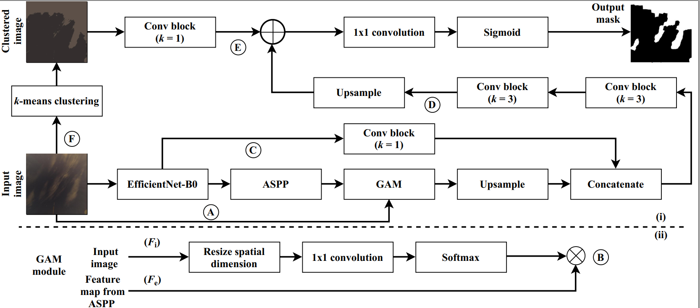
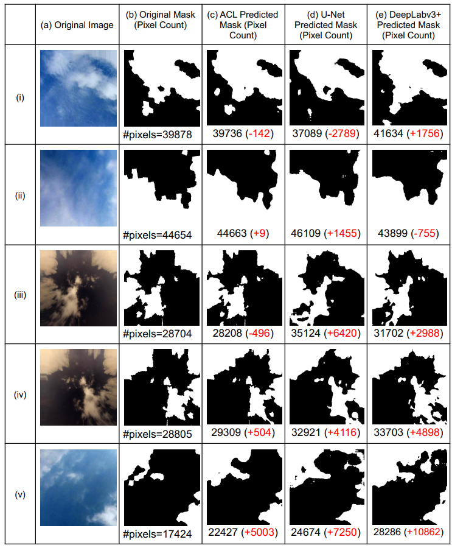

[](https://paperswithcode.com/sota/semantic-segmentation-on-swimseg?p=aclnet-an-attention-and-clustering-based)
[](https://paperswithcode.com/sota/semantic-segmentation-on-swinseg?p=aclnet-an-attention-and-clustering-based)
[](https://paperswithcode.com/sota/semantic-segmentation-on-swinyseg?p=aclnet-an-attention-and-clustering-based)

ACLNet: An Attention and Clustering-based Cloud Segmentation Network

==============================

This repository contains the source code of our paper, ACLNet (accepted for publication in <a href="https://www.tandfonline.com/journals/trsl20">Remote Sensing Letters</a>).

We propose a novel deep learning model named ACLNet, for cloud segmentation
from ground images. ACLNet uses both deep neural network and machine learning
(ML) algorithm to extract complementary features. Specifically, it uses EfficientNetB0 as the backbone, "atrous spatial pyramid pooling" (ASPP) to learn at multiple receptive fields, and "global attention module" (GAM) to extract fine-grained details from the image. ACLNet also uses k-means clustering to extract cloud boundaries more precisely. 



## Sample Results
<hr>

<p align="center"></p>

Project Organization
------------

    ├── LICENSE
    ├── README.md          <- The top-level README for developers using this project.
    ├── data
    │   └── processed      <- The final, canonical data sets for modeling.
    │
    ├── requirements.txt   <- The requirements file for reproducing the analysis environment.
    │
    ├── src                <- Source code for use in this project.
    │   ├── __init__.py    <- Makes src a Python module
    │   ├── config.py      <- All configuration params
    |   ├── util.py        <- All utilities functions
    │   │
    │   ├── data           <- Script to generate data in required format
    │   │   └── dataloader.py
    │   │
    │   ├── models         <- Scripts to train models and then use trained models to make
    │   │   │                 predictions and test performance.
    │   │   ├── train_model.py
    |   |   ├── test_model.py
    |   |   ├── network.py
    |   |   └── loss.py
    ├── inference          <- Inference directory, where predicted masks are stored.
    ├── logs               <- Logs directory for saving terminal output.
    ├── weights            <- Weights directory for saving checkpoints.
--------

## Get Started
<hr>
Dependencies:

```
pip install -r requirements.txt
```

### (Optional) Conda Environment Configuration

First, create a conda environment
```bash
conda create -n aclnet # python=3
conda activate aclnet
```

Now, add dependencies

Now, you can install the required packages.
```bash
pip install -r requirements.txt
```

### Dataset

We have used SWINySEG dataset which can be downloaded from <a href="http://vintage.winklerbros.net/swinyseg.html">SWINySEG</a> for training and SWIMSEG, and SWINSEG for inference which can be downloaded from <a href="http://vintage.winklerbros.net/swimseg.html">SWIMSEG</a> and <a href="http://vintage.winklerbros.net/swinseg.html">SWINSEG</a> respectively. Download, and unzip dataset in ```data/processed/``` directory. 

### Training

change the hyperparameters and configuration parameters according to need in ```src/config.py```.

To train aclnet, Run following command from ```/src``` directory.

```python models/train_model.py``` 

All the trained checkpoints for pre-training as well as full model training will be saved in ```/weights.```

Above command will train aclnet for given number of epochs in ```src/config.py```.

### Test performance

To test aclnet with trained model, Run following command from ```/src``` directory.

```python models/test_model.py ``` 

Above command will generate Precision, Recall, F1-Score, Error rate, Matthews Correlation Coefficient (MCC) and ROC AUC Curve. ROC-AUC Curve will be saved in ```inference/``` directory.

## Citation
```
@article{makwana2022aclnet,
  title={ACLNet: an attention and clustering-based cloud segmentation network},
  author={Makwana, Dhruv and Nag, Subhrajit and Susladkar, Onkar and Deshmukh, Gayatri and Teja R, Sai Chandra and Mittal, Sparsh and Mohan, C Krishna},
  journal={Remote Sensing Letters},
  volume={13},
  number={9},
  pages={865--875},
  year={2022},
  publisher={Taylor \& Francis}
}
```
## License
<hr>
CC BY-NC-ND 4.0
